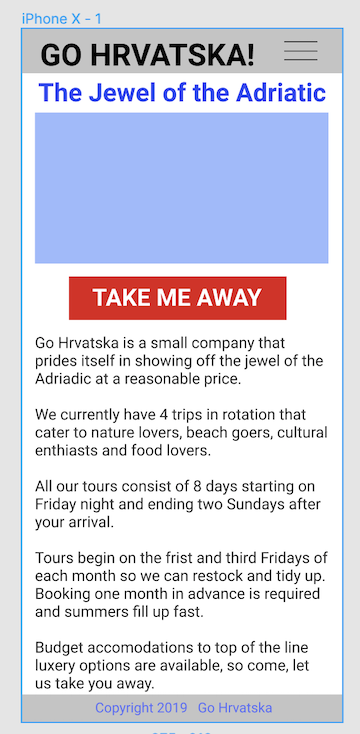
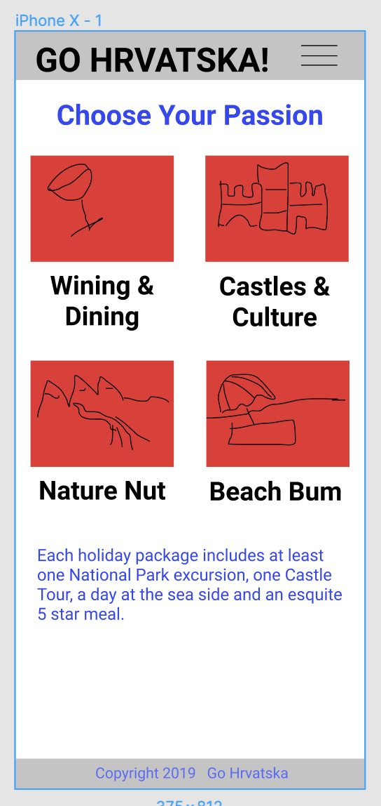
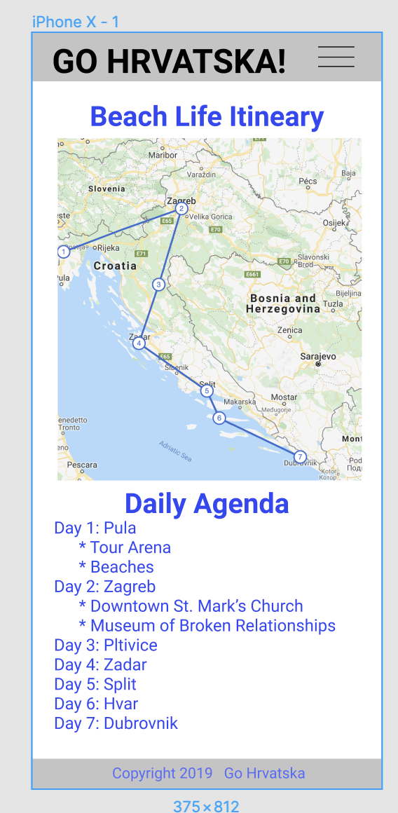

## Go Hrvatska! - Milestone Project 2
This website allows users to pick one of 4 prescribed tours of Croatia for their next holiday/vacation.  

**Main View:** When the user comes to the site, they see a banner image that rotates through stunning pictures that highlight Croatia's wonders. 
There is a call to action button to start choosing your trip below the banner.

**Picking Adventure View:** Upon clicking the Go Hrvatska button, the user is presented a screen where they choose from 4 trips.
Each tour has an image button across it which when clicked reveals a short description of the tour and a go Hrvatska button.

**Pick Accommodation View:** following the pick adventure view, the user is shown options regarding 6 different lodging options. Clicking the button label takes the user to the next view.
There is also a learn more button that reveals a popover that provides greater detail about each lodging choice.

**Itinerary View:** After selecting a tour and accommodations, the user is presented a view that summarizes a 7 day trip for their adventure.
A google map with the cities that are being visited is presented numbering day 1-7 with a linked list along the left of the map in desktop view. Below the map is a daily agenda
which has a large image retrived via google's Places API. 3-4 suggested places to visit with a small map for the day is shown. These small maps have infowindows on the map pins to
provide more details about each suggested place to visit.  Below the agenda is a button to email the itinerary. 

There is a start over button as well for views past the Main view.

## Author
Malia Havlicek

## UX 
The Go Hrvatska! Project was envisioned as a mobile website and then expanded to desktop. It is a single page application that helps
users determine an itinerary of places to see and visit while on Holiday in Croatia.

### Mockups
Note: The wireframes are not entirely accurate, they only give a rough estimate on how the website will look on a mobile device. The implied navigation in the
mockups was dropped once a single page application was determined as the solution framework.
[Figma.com](https://www.figma.com/) was used to create the following mockups:
- [Home Page](https://www.figma.com/file/741n0nfS9y7b1T2ICOAqDn/Go-Hrvatska?node-id=1%3A2)\
 
- [Choose Adventure](https://www.figma.com/file/741n0nfS9y7b1T2ICOAqDn/Go-Hrvatska?node-id=3%3A2)\
 
- [Itinerary](https://www.figma.com/file/741n0nfS9y7b1T2ICOAqDn/Go-Hrvatska?node-id=17%3A41)\
 
### User Stories
- **Hero Banner**: Eye Catching Landing Page with Enticing Imagery swapping out. Note: Only one image is required for initial banner. The subsequent images are injected via jquery.
- **Choose Adventure** html is built by looping through TRIPS json object. Fancy clip path CSS to do diagonal image on buttons. Customization of Bootstrap card and buttons.
- **Choose Accommodation** HTML is build by looping through ROOMS json object. Customization of Bootstap button and popover.
- **Itinerary** Uses google maps and google places API to highlight a 7 day trip based on User's Adventure Choice. HTML is built by looping through TRIPS json. Email.js is also provided to 
allow user to email the proposed agenda to themselves or others.

## Features

### Features Left to Implement
- use google places API to suggest matches on lodging choice via [nearby](https://developers.google.com/maps/documentation/javascript/places?utm_source=google&utm_medium=cpc&utm_campaign=FY18-Q2-global-demandgen-paidsearchonnetworkhouseads-cs-maps_contactsal_saf&utm_content=text-ad-none-none-DEV_c-CRE_315916118099-ADGP_Hybrid+%7C+AW+SEM+%7C+SKWS+~+Nearby+Search-KWID_43700039136946351-kwd-582432942915-userloc_9028759&utm_term=KW_%2Bnearby%20%2Bsearch-ST_%2Bnearby+%2Bsearch&gclid=EAIaIQobChMI8IKMxKaW5gIVj8DACh1GrQ6WEAAYASAAEgLKjvD_BwE#place_search_requests)
- migrate constants into database to reduce duplicate destinations
- store images in database to reduce flickering first time hero images are rotated through.

## Technologies Used
- [CSS3](https://www.w3schools.com/w3css/default.asp) The project uses **CSS** to define DOM appearance. 
- [HTML5](https://www.w3schools.com/html/default.asp) The project uses **HTML** to define DOM elements.
- [Bootstrap 4.0](https://getbootstrap.com/docs/4.0/getting-started/introduction/) Rather than re-invent many things, I chose to customize the look and feel of bootstrap 4.0 
- [jQuery3.3.1](https://api.jquery.com/) Used jQuery 3.3.1.slim.min.js as recommended by Bootstrap
- [emailJS](https://emailjs.com) - Send user the suggested itinerary via emailjs service

## Testing
Constant integration testing was preformed to ensure no console/javascript. Beyond that, validation testing, cross browser testing and accessibility testing were manually performed. 

### Validation Testing
Used the following validation websites to test the code:
- [CSS Validator](https://jigsaw.w3.org/css-validator/) Note, any error associated with root: color variables were ignored.
- [HTML Validator](https://validator.w3.org/)
- [JSON Validator](https://jsonlint.com/)

### Cross Browser and Cross Device Testing
For device testing, I would ideally have access to browser stack and derive a list of iOs devices and versions to test with from 
[David Smith's site](https://david-smith.org/iosversionstats/). Likewise, I would make use of stats from [android](https://developer.android.com/about/dashboards) 
to handpick android devices and versions to test with.  Then I'd test top browsers on PC's and Macs using the statistics from [w3Counter](https://www.w3counter.com/globalstats.php). 
Since I don't have a handful of devices or a proper testing tool suite at my fingertips, I'm going to rely on Chrome Dev tools and my windows PC.  

Below are the scenarios I picked to test my website:
* Windows 10, Edge
* Macbook Pro, Chrome
* Chrome Emulator Pixel 2
* ipad pro 9.7, Chrome

Note, I did look at my site in IE11 and it doesn't function as the flex grid from bootstrap 4 auto margins that I'm using are noted as [incompatible](https://getbootstrap.com/docs/4.4/utilities/flex/#auto-margins).

### Accessibility Testing
I used the AXE chrome plugin to test the accessibility of the website. https://www.deque.com/axe/ 

### Email Testing
Email was evaluated in Microsoft Outlook and gmail.

### Automated testing
Jasmine was considered as an automated testing option, but this site is heavy in presentation
and there are no standalone utility functions that Jasmine could help validate their continual functionality.

### Bugs Encountered
* **Image Query Limit** 
During manual unit testing, it was noticed that the imagery retrieved from google's places API was hitting
the Query Limit. To overcome this issue, the findImage call within maps.js BuildMapContent function was wrapped in a setTimout and incremented by 50ms starting at 100ms to 350ms in order
to prevent the issue.

* **Start over button going to wrong screen**
When adding the start over functionality, the user was going to the hero-banner view, not the select trip view. I had to change the trip view to have mustFolow false.

* **Map pins in the sea when zooming in**
Detailed maps sometimes had pins in the sea versus land despite pulling values from google.com/maps url parameters. I ended up using Sygic Maps to collect accurate values.

* **Bad JSON**
When building out my trips constant, I would often miss a closing bracket or comma. I used the JSON validator many times to quickly identify the problems when the console would show an
error with TRIPS not being defined.

* **Email too large**
EmailJS has a limit oj the size of the email sent via the free service. I opted for the challenge of sending a larger email and registered for th $5 tier. 

* **Email rendered horribly**
By embedding imagery in emails, I had to add a lot of inline styles to provide a coherent email that matches the website version rather than just stealing my itineray-details element.

* **blank and invalid email input accepted**
When unit testing, I noticed EmailJS allows you to send bad email addresses, rather than  build validation logic, I used Bootstrap 4.0's  by changing my
input form to match an example in their documentation.

* **user doesn't know status of email send**
I had console logs for errors and success for the send email function and the user had no idea what was going on. I updated the success and failures to output a message to the screen.

* **small devices places to visit map controls**
When testing small devices it was noted that the map controls were taking up too much space. I read the maps API documenation and figured out how to turn off some of the controls and
how to move them to a different location.

* **Small Devices other content required scrolling**
The desktop has a nice left side summary/legend of the Days, but it had to be hidden for small devices. There was no way for the user to really know  there was content below the main map.
I updated the main map to have infoWindows so the user can click on a marker, then expose a link to the places to see for that particular day. 
I also figured out how to change the zoom of the map if on small devices by looking at window.innerWidth. This allowed me to make the map shorter for small devices with the entire country in view. 
And a shorter map allows  a bit of the section under the map to visible on page load for small devices.

* **ipad pro 9.7 portrait view**
The site looked really bad for this view and I didn't want to waste more time for tablet CSS tweaking so I changed my breakpoint from 768px to 992.

## Deployment
Note: The coding for the project was done in PyCharm in a local environment with default configurations as it only requires javascript, CSS and HTML files. This website is 
hosted using GitHub pages, deployed directly from the master branch.

1. Logged into GitHub and created a new repository called go-hrvatska with a description of Milestone Project 2.
2. Cloned the repository to my local machine via PyCharm by clicking the VCS menu, then the git menu, then clone option and setting the url to https://github.com/maliahavlicek/go-hrvatska.git.
(could have opened the terminal and typed <strong>git clone https://github.com/maliahavlicek/go-hrvatska.git</strong>)
3. Created files and used the VCS menu to commit and push files as changes were made.
4. Once I was ready to deploy my solution, I logged into gitHub and navigated to the go-hrvatska repository.
5. Click on the settings icon and scroll down to the GitHub Pages section.
6. Select master-branch as the source.
7. Wait up to 10 minutes, then check your-username.github.io. Your website should be there!

## Credits

### Content
To gather rich imagery and interesting places to visit, I made use of the following websites:
- [Croatia.hr](http://croatia.hr/en-GB) - A huge variety of fantastic imagery and numerous places to visit were gleaned from reading this site. Hvala!
- [Chasing The Donkey](https://www.chasingthedonkey.com/croatia-travel-blog/) - Is a blog site that has many interesting facts and things to do while visiting Croatia that only insiders know about including quirky museums, great local festivals and everything about The Game of Thrones filming. I used bits of their various lists to customize the itineraries.
- [Croatia Week](https://www.croatiaweek.com) - This site has articles with lists of places of interest that I used when customizing the prescribed trips and was used to help fact check which sites might be of most interest to tourists.
- [Sygic Maps](https://maps.sygic.com/?utm_source=content-pages&utm_medium=cta&utm_campaign=list#/?item=poi:5232499&map=9,44.917167,14.004822) - This map has spots flagged by categories and provides accurate lat, lng values for them.
- Other sites used for specific places to see are attributed in the map pin info windows.
### Media
Hero imagery seen in this project was gleaned from the sites listed below. Ordinal imagery has been renamed and resized.
- [Croatia.hr](http://croatia.hr/en-GB) 
- [ChasingTheDonkey](https://www.chasingthedonkey.com/croatia-travel-blog/) 
- [CroatiaWeek](https://www.croatiaweek.com)
- Imagery gleaned from google's Places API are attributed in line if such information is provided in the API response.

### Acknowledgements
- [w3schools](https://www.w3schools.com/w3css/tryit.asp?filename=tryw3css_slideshow_rr) - The main page slideshow of images found its beginnings from w3school's example.
- [tutorialzine](https://tutorialzine.com/2017/03/css-triangles-without-hacks) - The diagonal cut of images on the trip selection page started from this tutorial on how to make CSS triangles.
- [clippy](https://bennettfeely.com/clippy/) - This tool makes it easy to determine clip paths without getting lost in the inverse y coordinate bliss of CSS.
- [google Maps Javascript API](https://developers-dot-devsite-v2-prod.appspot.com/maps/documentation/javascript/examples/) - Custom Animated Markers, polylines and infowindows for main map.
- [google Places Search API ](https://developers-dot-devsite-v2-prod.appspot.com/maps/documentation/javascript/examples/place-search)- Documentation helped set up request for places search to get a google place_id
- [google Places Details API](https://developers-dot-devsite-v2-prod.appspot.com/maps/documentation/javascript/examples/place-details)- Provided a good example of how use a place_id to retrieve Places Details response to get imagery for itinerary page.
- [javascript constants](https://www.linkedin.com/in/syedmhassan/) - Moosa Hassan suggested to move large json constants out of functional javascript files into constants.js
- [geographic points](https://maps.sygic.com/) - Accurate latitude and longitude points for map pins that don't float in the sea.
- [styling emails](https://www.campaignmonitor.com/css/) - Making emails look good is incredibly difficult